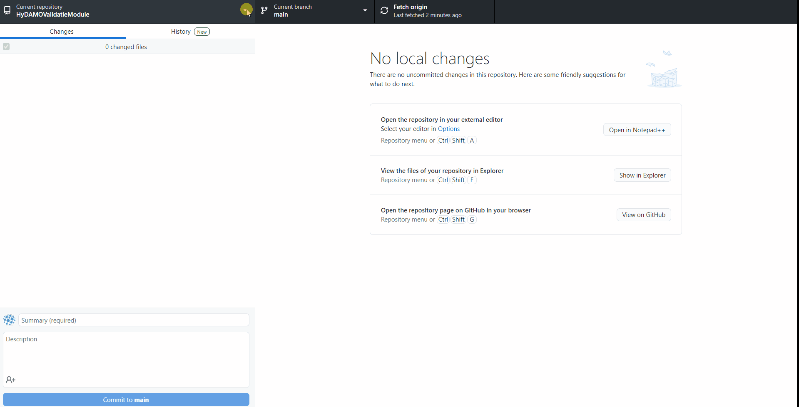
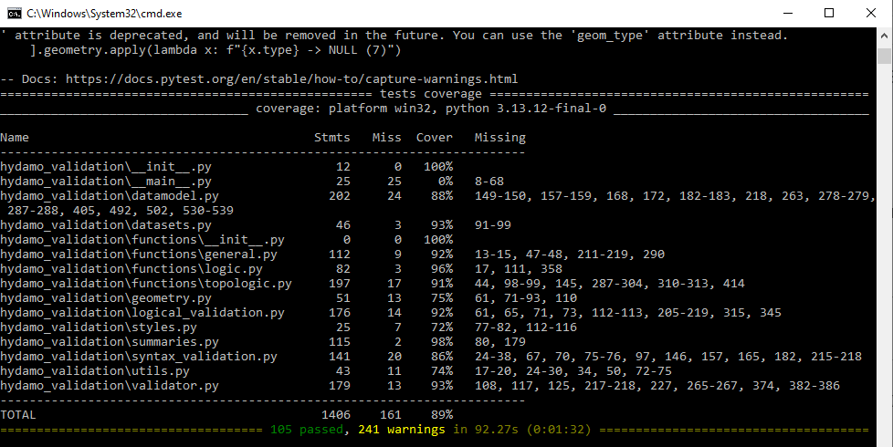
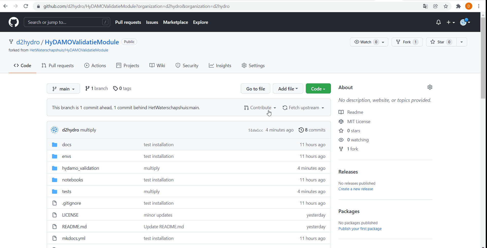

# Contribute

For doing contributions you:

* have your own [GitHub account](https://github.com/join)
* work with [GitHub Desktop](https://desktop.github.com) or work-round with Git
* can work with [GeoPandas](https://geopandas.org) and [Pytest](https://www.pytest.org/)

We are very happy with code that is:

1. written similar to existing code (e.g. use of GeoPandas)
2. provided with docstrings so it can be documented
3. tested with Pytest

## Installation

### Create `validatietool` environment for development
Use the `env/dev_environment.yml` in the repository to create the conda environment `validatietool` with all required packages

```
conda env create -f dev_environment.yml
```

After installation you can activate your environment in command prompt

### Get a copy
Fork the respository to your own GitHub account:

1. Click `fork` in the upper-right of the rository.
2. Select your own github account

The repository is now available on your own github account:


Now clone your fork to your local drive. We do this with [GitHub Desktop](https://desktop.github.com). After [installation and authentication](https://docs.github.com/en/desktop/installing-and-configuring-github-desktop/overview/getting-started-with-github-desktop)
you can get a local copy by:

1. `Add` and `Clone repository...` in the top-left corner
2. Find your fork and clone it to an empty directory on your local drive
3. Press  clone`



Verify if the repository is on your local drive. 

### Install your copy of hydamo_validation in develop-mode
Install the module in the activated `validatietool` environment in develop-mode:

```
pip install -e .
```

__Now you're good to go!__

## Make an improvement
Imagine we want to be able to multiply an HyDAMO attribute by a constant value or a value in an other attribute.
Therefore we will add a function `multiply` to the general functions

### Edit code
In functions.general.py we add our new function:

```python
def multiply(gdf, left, right):
    """
    Multiply 'left' with 'right'

    Parameters
    ----------
    gdf : GeoDataFrame
        Input GeoDataFrame
    left : str, numeric
        Left column or value in expression
    right : str, numeric
        Right column or value in expression

    Returns
    -------
    result : Series
        Float series

    """
    expression = " * ".join(map(str, [left, right]))
    return gdf.eval(expression)

```

Please note the use of [numpy docstrings](https://numpydoc.readthedocs.io/en/latest/format.html#docstring-standard).
These are required as they are later translated to documentation.

Also note we use [GeoPandas GeoDataFrames](https://geopandas.org/en/stable/docs/reference/api/geopandas.GeoDataFrame.html) specified by
the input variable `gdf`. Please make your code fast and efficient by the use of in-build methods. Above we use `gdf.eval(expression)` by example.

In complex cases you can use `gdf.apply(lambda x: _a_function_for_every_row(row, *args, **kwargs), axis=1)` to apply a function on every `row` in your
GeoDataFrame. Here `*args` and `**kwargs` refer to extra input arguments. In `functions.topologic.py` and `functions.logic.py` you can find numerous examples.

### Test your code
In the test-folder we add a test. In this case we can add it to `tests.general_functions_test.py`:

```python
def test_multiply():
    _gdf = gpd.GeoDataFrame(data={"left": [1, 2, 3],
                                  "right": [4, 5, 6],
                                  "geometry": [None, None, None]})
    expected_result = [4, 10, 18]
    result = general_functions.multiply(_gdf, left="left", right="right").to_list()
    assert result == expected_result
```

A test-function starts with `test_`. In within the test-function you confirm if your new functionity is correct with `assert = True`. In this case
we check if the `result` of our function is the same as our `expected_result`

Within your activated environment you can test your function with pytest:

```
pytest --cov-report term-missing --cov=hydamo_validation tests/
```

As your function is correct, the test should not fail. You can confirm all lines of your new code are tested:


## Do the contribution

### commit
First commit your new function in your own repository:


### request a merge
Now request a merge:


